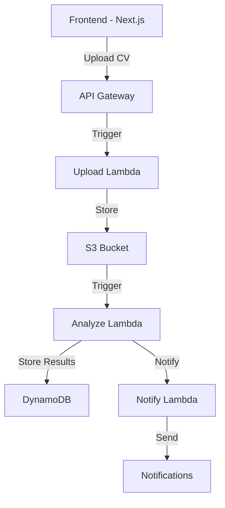

# 🚀 SillarCV - Sistema Inteligente de Análisis de CVs

<div align="center">
  

[](https://www.pulumi.com/)
[](https://aws.amazon.com/)
[](https://nextjs.org/)

</div>

## 📋 Descripción

SillarCV es una plataforma serverless moderna para el análisis automatizado de currículums vitae (CVs). Utilizando la potencia de AWS Lambda y servicios de IA, el sistema procesa, analiza y extrae información valiosa de los CVs subidos por los usuarios.

## 🏗️ Arquitectura



### 🔧 Componentes Principales

- **Frontend**: Aplicación Next.js moderna y responsive
- **API Gateway**: Gestión de endpoints RESTful
- **Lambda Functions**:
  - `upload_cv`: Manejo de subida de archivos
  - `analyze_cv`: Procesamiento y análisis de CVs
  - `notify`: Sistema de notificaciones
- **S3**: Almacenamiento seguro de documentos
- **DynamoDB**: Base de datos NoSQL para resultados
- **CloudFront**: CDN para distribución global del frontend

## 🚀 Inicio Rápido

### Prerrequisitos

- Node.js (v18 o superior)
- Python 3.10+
- AWS CLI configurado
- Pulumi CLI
- Make (opcional)

### Configuración del Entorno

1. **Clonar el repositorio**

   ```bash
   git clone <repository-url>
   cd sillarcv
   ```

2. **Instalar dependencias del backend**

   ```bash
   pip install -r requirements.txt
   ```

3. **Configurar el frontend**

   ```bash
   cd sillar-cv-fe
   npm install
   ```

4. **Configurar variables de entorno**

   ```bash
   # Backend (.env)
   cp .env.example .env

   # Frontend (sillar-cv-fe/.env)
   cp .env.example .env.local
   ```

### 🌐 Despliegue

1. **Infraestructura (Pulumi)**

   ```bash
   pulumi up
   ```

2. **Frontend (Next.js)**
   ```bash
   cd sillar-cv-fe
   ./deploy.sh
   ```

## 📦 Estructura del Proyecto

```
sillarcv/
├── __main__.py           # Configuración principal de Pulumi
├── lambdas/              # Funciones Lambda
│   ├── analyze_cv.py     # Análisis de CVs
│   ├── notify.py         # Notificaciones
│   └── upload_cv.py      # Subida de archivos
├── sillar-cv-fe/         # Frontend Next.js
└── ...                   # Otros archivos de configuración
```

## 🛠️ Desarrollo Local

1. **Ejecutar el frontend**

   ```bash
   cd sillar-cv-fe
   npm run dev
   ```

2. **Emular funciones Lambda**
   ```bash
   # Usando AWS SAM o similar
   make local
   ```

## 📚 Documentación Adicional

- [Guía de Contribución](CONTRIBUTING.md)
- [Documentación de API](API.md)
- [Guía de Despliegue](DEPLOYMENT.md)

## 🔐 Seguridad

El proyecto implementa las mejores prácticas de seguridad:

- Autenticación y autorización robusta
- Encriptación en tránsito y en reposo
- Políticas IAM restrictivas
- Validación de archivos
- CORS configurado adecuadamente

## 📄 Licencia

Este proyecto está licenciado bajo [MIT License](LICENSE).

## 👥 Equipo

Desarrollado con ❤️ por el equipo de SillarCV.

---

<div align="center">
   Disponible globalmente a través de AWS CloudFront
